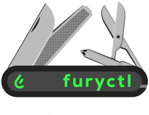

<!-- markdownlint-disable MD033 -->
<h1 align="center">
  <!-- Using a temporary PNG until we get the updated SVG -->
  <!--  -->
  

<p>The Swiss Army Knife<br/>for the Kubernetes Fury Distribution</p>

<!-- FIXME: UPDATE THE BUILD BADGE WITH THE RIGHT BRANCH -->
[](https://ci.sighup.io/sighupio/furyctl)


[](https://goreportcard.com/report/github.com/sighupio/furyctl)

</h1>
<!-- markdownlint-eable MD033 -->

<!-- <KFD-DOCS> -->

> We are in the process of rewriting `furyctl` from the ground up. The new version is called `furyctl-ng` and is currently in `alpha` status, and will be released starting from version `v0.25.0-alpha.1`. The former version of `furyctl` will be enter 'bugfix only' maintenance until the new version is stable enough to replace it, and it will live under the old `v0.1x` branches.

`furyctl` is the command line companion for the Kubernetes Fury Distribution to manage the **full lifecycle** of your Kubernetes Fury clusters.
<br/>

> 💡 Learn more about the Kubernetes Fury Distribution in the [official site](https://kubernetesfury.com).


If you're looking for the old documentation, you can find it [here](https://github.com/sighupio/furyctl/blob/main/README.md).

## Installation

### Installing from binaries

You can find `furyctl` binaries on the [Releases page](https://github.com/sighupio/furyctl/releases).

To download the latest release, run:

```console
curl -L "https://github.com/sighupio/furyctl/releases/download/v0.25.0-alpha.1/furyctl_$(uname -s)_x86_64.tar.gz" -o /tmp/furyctl.tar.gz && tar xfz /tmp/furyctl.tar.gz -C /tmp
chmod +x /tmp/furyctl
sudo mv /tmp/furyctl /usr/local/bin/furyctl
```

Alternatively, you can install `furyctl` using a brew tap or via an asdf plugin.

> ❗️**WARNING**
>
> M1 users: please download `darwin/amd64` binaries instead of using homebrew or asdf. Even though furyctl can be built for `arm64`, some of its dependendecies are not available yet for this architecture.

<!--
### Installing with [Homebrew](https://brew.sh/)

```console
brew tap sighupio/furyctl
brew install furyctl
```

### Installing with [asdf](https://github.com/asdf-vm/asdf)

Add furyctl asdf plugin:

```console
asdf plugin add furyctl
```

Check that everything is working correctly with `furyctl version`:

```console
$ furyctl version
buildTime: 2023-01-13T09:50:15Z
gitCommit: 349c14a06dd6163b308e4e8baa47ec9cc59712e1
goVersion: go1.19
osArch: amd64
version: 0.25.0-alpha.1
``` -->

### Installing from source

Prerequisites:

- `make >= 4.1`
- `go >= 1.19`
- `goreleaser >= v1.15`

> You can install `goreleaser` with the following command once you have Go in your system:
>
> ```console
> go install github.com/goreleaser/goreleaser@v1.15.2
> ```

Once you've ensured the above dependencies are installed, you can proceed with the installation.

1. Clone the repository:

<!-- FIXME: remove the branch switching in the future -->
```console
git clone git@github.com:sighupio/furyctl.git
# cd into the cloned repository
cd furyctl
# Switch to the branch for the `furyctl-ng-alpha1` version
git switch furyctl-ng-alpha1
```

2. Build the binaries by running the following command:

```console
make build
```

3. You will find the binaries for Linux, Darwin (macOS) and Windows for your current architecture inside the `dist` folder:

```console
$ tree dist/furyctl_*/
dist/furyctl_darwin_amd64_v1
└── furyctl
dist/furyctl_linux_amd64_v1
└── furyctl
dist/furyctl_windows_amd64_v1
└── furyctl.exe
```

4. Check that the binary is working as expected:

> **Note** replace `darwin` with your OS and `amd64` with your architecture in the following commands.

```console
./dist/furyctl_darwin_amd64_v1/furyctl version
```

5. (optional) move the binary to your `bin` folder, in macOS:

```console
sudo mv ./dist/furyctl_darwin_amd64_v1/furyctl /usr/local/bin/furyctl
```

## Usage

See all the available commands and their usage by running `furyctl help`.

> 💡 **TIP**
>
> Enable command tab autocompletion for `furyctl` on your shell (`bash`, `zsh`, `fish` are supported).
> See the instruction on how to enable it with `furyctl completion --help`

<!-- line left blank as spacer -->

> ❗️**WARNING**
>
> `furyctl` is compatible with KFD versions 1.25.2+.

### Basic Usage

Basic usage of `furyctl` for a new project consists on the following steps:

1. Creating a configuration file defining the prequired infrastructure, Kubernetes cluster details, and KFD modules configuration.
2. Creating a cluster as defined in the configuration file.
3. Destroying the cluster and its related resources.

#### 1. Create a configuration file

`furyctl` provides a command that outputs a sample configuration file (by default called `furyctl.yaml`) with all the possible fields explained in comments.

Furyctl configuration files have a kind that specifies what type of cluster will be created, for example the `EKSCluster` kind has all the parameters needed to create a KFD cluster using the EKS managed clusters from AWS.

Additionaly, the schema of the file is versioned with the `apiVersion` field, so when new features are introduced you can switch to a newer version of the configuration file structure.

To scaffold a configuration file to use as a starter, you use the following command:

```console
furyctl create config --version v1.25.2 --kind "EKSCluster"
```

Alternatively, you can take a look at the one in the [examples folder](./examples/).

> 💡 **TIP**
>
> You can pass some additional flags, like the schema (API) version of the configuration file or a different configuration file name.
>
> See `furyctl create config --help` for more details.

Open the generated configuration file with your editor of choice and edit it according to your needs. You can follow the instructions included as comments in the file.

Once you have filled your configuration file, you can check that it's content is valid by running the following comand:

```console
furyctl validate config --config /path/to/your/furyctl.yaml
```

> 📖 **NOTE**
>
> The `--config` flag is optional, set it if your configuration file is not named `furyctl.yaml`

#### 2. Create a cluster

Requirements (EKSCluster):

- AWS CLI
- OpenVPN (when filling the `vpn` field in the configuration file)

In the previous step, you have created and validated a configuration file that defines the Kubernetes cluster and its sorroundings, you can now proceed to actually creating the resources.

Furyctl divides the cluster creation in three phases: `infrastructure`, `kubernetes` and `distribution`.

1. The first phase, `infrastructure`, creates all the prerequisites needed to be able to create a cluster. For example, the VPC and its networks.
2. The second phase, `kubernetes`, creates the actual Kubernetes clusters. For example, the EKS cluster and its node pools.
3. The third phase, `distribution`, deploys KFD modules to the Kubernetes cluster.

> 📖 **NOTE**
>
> You will find these three phases when editing the furyctl.yaml file.

Just like you can validate that your configuration file is well formed, `furyctl` let you check that you have all the needed dependencies (environment variables, binaries, etc.) before starting a cluster creation process.

To validate that your system has all the dependencies needed to create the cluster defined in your configuration file, run the following command:

```console
furyctl validate dependencies
```

Last but not least, you can launch the creation of the resources defined in the configuration file by running the following command:

> ❗️ **WARNING**
>
> You are about to create cloud resources that could have billing impact.
<!-- spacer -->
> 📖 **NOTE**
>
> The cluster creation process, by default, will create a VPN in the `infrastructure` phase and connect your machine to it automatically before proceeding to the `kubernetes` phase.

```console
furyctl create cluster --config /path/to/your/furyctl.yaml
```

> 📖 **NOTE**
>
> The creation process will take a while.

🎉 Congratulations! You have created your production-grade Kubernetes Fury Cluster from scratch and it is now ready to go into battle.

#### 3. Destroy a cluster

Destroying a cluster can be thought as running the creation phases in reverse order. `furyctl` automates this operation for you.

To destroy a cluster created using `furyctl` and all its related resources, run the following command:

> ❗️ **WARNING**
>
> You are about to run a destructive operation.

```console
furyctl delete cluster --dry-run
```

Check that the dry-run output is what you expect and then run the command again without the `--dry-run` flag to actually delete all the resources.

> 💡 **TIP**
>
> Notice the `--dry-run` flag, used to check what the command would do. This flag is available for other commands too.

### Advanced Usage

#### KFD modules management

`furyctl` can be used as a package manager for KFD.

It provides a simple way to download all the desired modules of the KFD by reading a single `furyctl.yaml`.

The process requires the following steps:

1. Generate a `furyctl.yaml` by running `furyctl create config` specifying the desired Kubernetes Fury Distribution version using the `--version` flag.
2. Run `furyctl download dependencies` to download all the dependencies including the modules of the KFD.

##### 1. Customizing the `furyctl.yaml`

A `furyctl.yaml` is a YAML-formatted file that contains all the information that is needed to create a Kubernetes Fury cluster.

Modules are located in the `distribution` section of the `furyctl.yaml` file and can be configured to better fit your needs.

##### 2. Downloading the modules

Run `furyctl download dependencies` (within the same directory where your `furyctl.yaml` is located) to download the modules and all the dependencies that are needed to create a Kubernetes Fury cluster.

#### Cluster creation

The following steps will guide you through the process of creating a Kubernetes Fury cluster from zero.

1. Follow the previous steps to generate a `furyctl.yaml` and download the modules.
2. Edit the `furyctl.yaml` to customize the cluster configuration by filling the sections `infrastructure`, `kubernetes` and `distribution`.
3. Check that the configuration file is valid by running `furyctl validate config`.
4. Run `furyctl create cluster` to create the cluster.
5. (Optional) Watch the logs of the cluster creation process with `tail -f ~/.furyctl/furyctl.log`.

#### Create a cluster in an already existing infrastructure

Same as the previous section, but you can skip the infrastructure creation phase
by not filling the section `infrastructure` in the `furyctl.yaml` file and
running `furyctl create cluster --skip-phase infrastructure`.

#### Deploy a cluster step by step

The cluster creation process can be split into three phases:

1. Infrastructure
2. Kubernetes
3. Distribution

The `furyctl create cluster` command will execute all the phases by default,
but you can limit the execution to a specific phase by using the `--phase` flag.

To create a cluster step by step, you can run the following command:

```bash
furyctl create cluster --phase infrastructure'
```

If you choose to create a VPN in the infrastructure phase, you can automatically connect to it by using the flag `--vpn-auto-connect`.

```bash
furyctl create cluster --phase kubernetes'
```

After running the command, remember to export the `KUBECONFIG` environment variable to point to the generated kubeconfig file or
to use the flag `--kubeconfig` in the following command.

```bash
furyctl create cluster --phase distribution'
```

### Advanced Tips

Furyctl comes with the flag `--distro-location`, allowing you to use a local copy of KFD instead of downloading it from the internet. This allows you to test changes to the KFD without having to push them to the repository, and might come in handy when you need to test new features or bugfixes.

<!-- </KFD-DOCS> -->
<!-- <FOOTER> -->

### Test classes

There are four kind of tests: unit, integration, e2e, and expensive.

Each of them covers specific use cases depending on the speed, cost, and dependencies at play in a given scenario.
Anything that uses i/o should be marked as integration, with the only expection of local files and folders: any test
that uses the local filesystem and nothing more can be marked as 'unit'. This is made for convenience and it's open to
change in the future should we decide to refactor the code to better isolate that kind of i/o from the logic of the tool.

That said, here's a little summary of the used tags:

- unit: tests that exercise a single component or function in isolation. Tests using local files and dirs are permitted here.
- integration: tests that require external services, such as github. Test using only local files and dirs should not be marked as integration.
- e2e: tests that exercise furyctl binary, invoking it as a cli tool and checking its output
- expensive: e2e tests that incur in some monetary cost, like running an EKS instance on AWS

### Reporting Issues

In case you experience any problems with `furyctl`, please [open a new issue](https://github.com/sighupio/furyctl/issues/new/choose) on GitHub.

## License

This software is open-source and it's released under the following [LICENSE](LICENSE).

<!-- </FOOTER> -->
