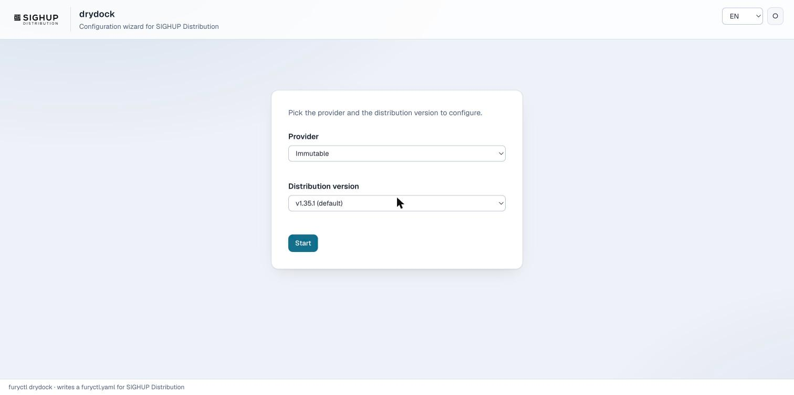
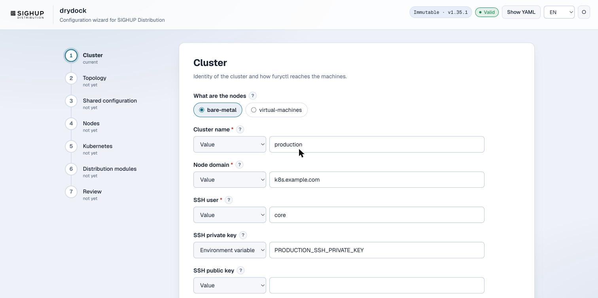
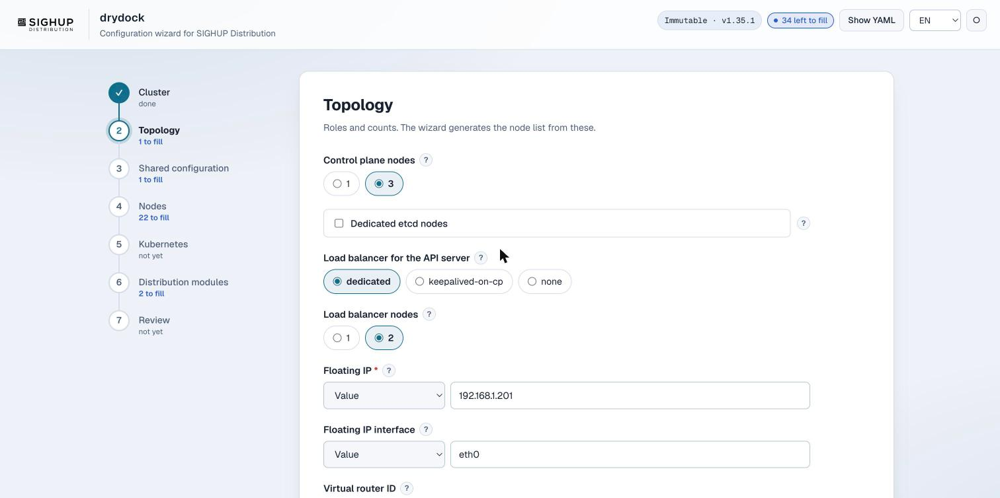
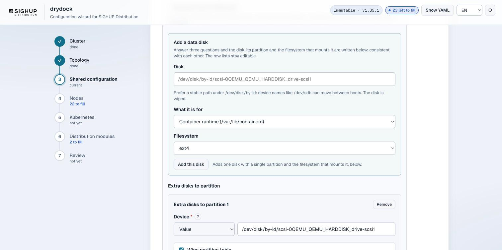
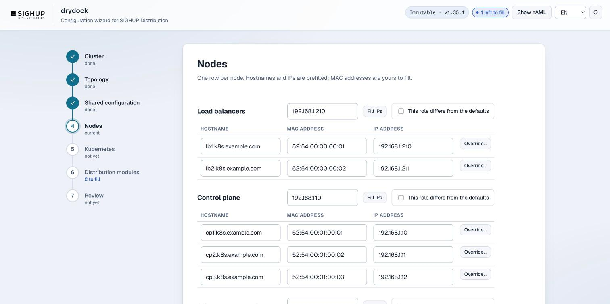
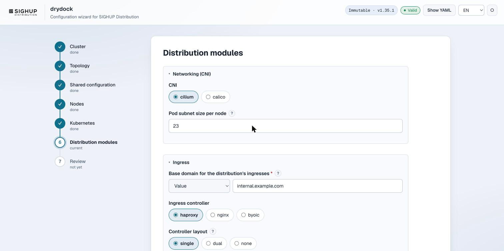
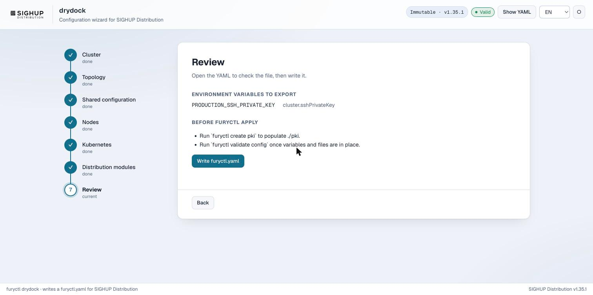
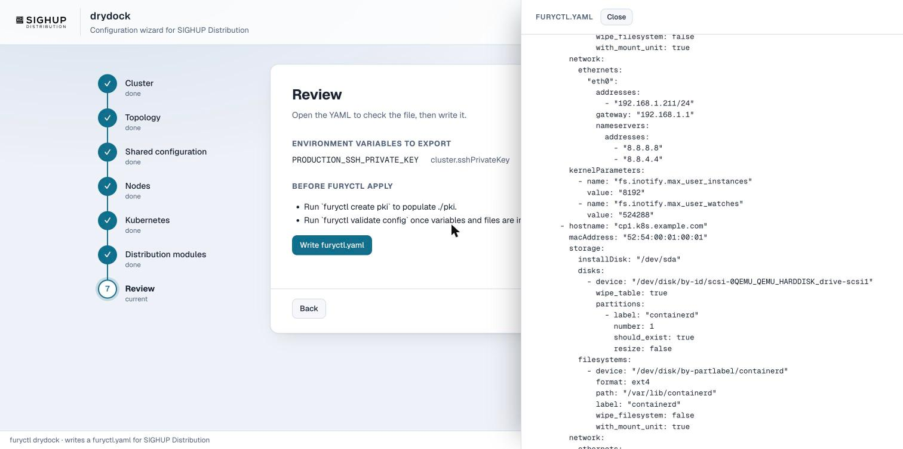

# `furyctl drydock`

A local web wizard that writes a `furyctl.yaml`. It runs on your machine, asks about the cluster
the way a colleague would, generates the repetitive parts of the file itself, and validates what it
produces against the JSON schema of the distribution version you picked.

```bash
furyctl drydock
```

The browser opens on `http://127.0.0.1:8080`. Press ENTER in the terminal to stop it; it also stops
by itself once the file is written.

| Flag | Default | What it does |
|---|---|---|
| `-a, --address` | `127.0.0.1` | Address to listen on. It writes files on this machine, so it stays on loopback unless you say otherwise. |
| `-p, --port` | `8080` | Port to listen on. |
| `--output` | `furyctl.yaml` | Where the file is written. It refuses to overwrite an existing one. |
| `--distro-location` | empty | A local checkout or URL of the distribution, instead of downloading it. |
| `--git-protocol` | `https` | `https` or `ssh`, for the download. |
| `--no-browser` | `false` | Do not open the browser. |

Only the Immutable provider has a wizard today, for distribution v1.35.x.

## Pick the provider and the version

The versions offered are the releases the wizard supports and this `furyctl` can install. With
`--distro-location` there is exactly one: the version of that checkout.



## Cluster

The first question is what the machines are. Answering **bare metal** turns on the settings the
SIGHUP Distribution documentation prescribes for physical machines, which appear further along in
the wizard, already filled in where the documentation gives a value.

Every free-text field has a source next to it: a literal value, an environment variable, the
contents of a file, a path, or a URL. The wizard preselects one where the value is a secret or
belongs outside the file, as with the SSH key below. `furyctl` expands these when it applies the
configuration, so nothing sensitive has to live in the YAML.

The `?` next to a label opens the explanation and a realistic example, which one click copies into
the field.



## Topology

Roles and counts, not a node list. From these the wizard works out the nodes, the load balancer
members, the keepalived floating IP, the control plane and etcd members, and the node groups with
their labels and taints.



## Shared configuration

What every node has in common: architecture, install disk, interface, addressing, DNS. Under
**Advanced node configuration** there is everything Butane accepts on a node, and above it the
**add a data disk** helper: give it a disk, say what the disk is for, and it writes the disk with
its partition and the filesystem that mounts it, referenced by partition label. The raw lists below
stay editable.



## Nodes

One row per node. Hostnames come from the cluster domain, IPs are filled from the first address of
each role, and the MAC addresses are the one thing that cannot be derived. Any node, or any whole
role, can differ from the shared configuration through **Override**.



## Kubernetes and the distribution modules

Pod and service CIDR, kube-proxy, encryption at rest, OIDC on the API server, and then one card per
module: networking, ingress, logging, monitoring, tracing, policy, disaster recovery,
authentication. Only the first-level choices, with the rest left to the distribution's own defaults.



## Review, then write

The review lists the environment variables to export, the files to prepare, and what is left to do
before `furyctl apply`. While something required is still empty, the wizard says which field in
which step instead of refusing with a generic error, and the step is one click away.



The file itself is one button away at any point, in a drawer that stays closed until asked. The
status next to it counts what is still to fill in a calm blue and turns amber only when a value is
actually wrong.



## After writing

The file is complete but not yet appliable: the PKI does not exist and the environment variables
are not exported. In the order the review gives them:

```bash
export PRODUCTION_SSH_PRIVATE_KEY=~/.ssh/id_ed25519
furyctl create pki --path ./pki
furyctl validate config
furyctl apply
```

## Where the wizard's advice comes from

The values it offers are transcribed from the documentation, not invented:

- the inotify limits, the pods per node against the size of the node subnet, the resources reserved
  for the system and the three paths that deserve a dedicated volume come from **Installing on
  bare-metal nodes**;
- the minimum sizing quoted per role comes from **Requirements**.

The settings the installer applies by itself, such as `br_netfilter` and
`net.bridge.bridge-nf-call-iptables`, are deliberately not offered: setting them by hand would only
add noise to the file.
